```mermaid
graph LR
    A[sql_equivalence] --> B[__init__.py]
    A --> C[parser]
    C --> C1[__init__.py]
    C --> C2[sql_parser.py]
    C --> C3[ast_builder.py]
    C --> C4[normalizer.py]
    
    A --> D[representations]
    D --> D1[__init__.py]
    D --> D2[base.py]
    D --> D3[algebraic]
    D3 --> D31[__init__.py]
    D3 --> D32[relational_algebra.py]
    D3 --> D33[operators.py]
    D3 --> D34[expression_tree.py]
    D --> D4[graph]
    D4 --> D41[__init__.py]
    D4 --> D42[query_graph.py]
    D4 --> D43[lqt.py]
    D4 --> D44[graph_builder.py]
    D --> D5[embedding]
    D5 --> D51[__init__.py]
    D5 --> D52[encoder.py]
    D5 --> D53[node_embedding.py]
    D5 --> D54[graph_embedding.py]
    
    A --> E[equivalence]
    E --> E1[__init__.py]
    E --> E2[base.py]
    E --> E3[algebraic_equivalence.py]
    E --> E4[graph_equivalence.py]
    E --> E5[embedding_similarity.py]
    
    A --> F[operators]
    F --> F1[__init__.py]
    F --> F2[base_operator.py]
    F --> F3[relational_operators.py]
    F --> F4[set_operators.py]
    F --> F5[aggregate_functions.py]
    F --> F6[window_functions.py]
    F --> F7[scalar_functions.py]
    
    A --> G[transformations]
    G --> G1[__init__.py]
    G --> G2[algebraic_rules.py]
    G --> G3[graph_transformations.py]
    G --> G4[optimization_rules.py]
    
    A --> H[utils]
    H --> H1[__init__.py]
    H --> H2[sql_utils.py]
    H --> H3[graph_utils.py]
    H --> H4[algebra_utils.py]
    H --> H5[visualization.py]
    
    A --> I[models]
    I --> I1[__init__.py]
    I --> I2[ml_models.py]
    I --> I3[similarity_models.py]
    I --> I4[embedding_models.py]
    
    A --> J[examples]
    J --> J1[__init__.py]
    J --> J2[basic_examples.py]
    J --> J3[advanced_examples.py]
    
    A --> K[tests]
    K --> K1[__init__.py]
    K --> K2[test_parser.py]
    K --> K3[test_algebraic.py]
    K --> K4[test_graph.py]
    K --> K5[test_equivalence.py]

```

# Task

# Structure

```
sql_equivalence/
├── __init__.py
├── parser/
│   ├── __init__.py
│   ├── sql_parser.py          # SQL解析主模块
│   ├── ast_builder.py         # 构建抽象语法树
│   └── normalizer.py          # SQL标准化处理
│
├── representations/
│   ├── __init__.py
│   ├── base.py                # 基础表示类
│   ├── algebraic/
│   │   ├── __init__.py
│   │   ├── relational_algebra.py  # 关系代数表达式
│   │   ├── operators.py           # 代数算子定义
│   │   └── expression_tree.py     # 代数表达式树
│   │
│   ├── graph/
│   │   ├── __init__.py
│   │   ├── query_graph.py         # 查询图表示
│   │   ├── lqt.py                # 逻辑查询树(LQT)
│   │   └── graph_builder.py       # 图构建器
│   │
│   └── embedding/
│       ├── __init__.py
│       ├── encoder.py             # 编码器基类
│       ├── node_embedding.py      # 节点嵌入
│       └── graph_embedding.py     # 图嵌入
│
├── equivalence/
│   ├── __init__.py
│   ├── base.py                    # 等价性比较基类
│   ├── algebraic_equivalence.py   # 代数等价性判断
│   ├── graph_equivalence.py       # 图同构等价性判断
│   └── embedding_similarity.py    # 嵌入相似度计算
│
├── operators/
│   ├── __init__.py
│   ├── base_operator.py           # 算子基类
│   ├── relational_operators.py    # 关系算子(SELECT, FROM, JOIN等)
│   ├── set_operators.py           # 集合算子(UNION, INTERSECT等)
│   ├── aggregate_functions.py     # 聚合函数
│   ├── window_functions.py        # 窗口函数
│   └── scalar_functions.py        # 标量函数
│
├── transformations/
│   ├── __init__.py
│   ├── algebraic_rules.py         # 代数变换规则
│   ├── graph_transformations.py   # 图变换规则
│   └── optimization_rules.py      # 查询优化规则
│
├── utils/
│   ├── __init__.py
│   ├── sql_utils.py              # SQL工具函数
│   ├── graph_utils.py            # 图算法工具
│   ├── algebra_utils.py          # 代数运算工具
│   └── visualization.py          # 可视化工具
│
├── models/
│   ├── __init__.py
│   ├── ml_models.py              # 机器学习模型接口
│   ├── similarity_models.py       # 相似度计算模型
│   └── embedding_models.py        # 嵌入模型
│
├── examples/
│   ├── __init__.py
│   ├── basic_examples.py         # 基础示例
│   └── advanced_examples.py      # 高级示例
│
└── tests/
    ├── __init__.py
    ├── test_parser.py
    ├── test_algebraic.py
    ├── test_graph.py
    └── test_equivalence.py
```



