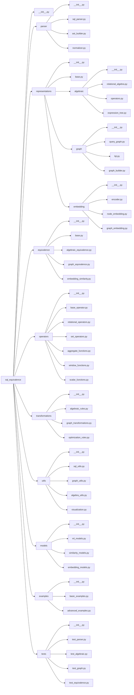

# SQL Equivalence Analysis Library

A comprehensive Python library for analyzing SQL query equivalence using algebraic, graph-based, and embedding-based approaches.

This is part of my Open NL2SQL/Chat2BI Course (2025-Dec).

Lic: Apache 2.0 
Yifan Yang <yfyang.86 hotmail>

cite: 

```latex
@misc{yfyang2025sqlequiv,
    title={A comprehensive Python library for analyzing SQL query equivalence using algebraic, graph-based, and embedding-based approaches.},
    year={2025},
    author={Yifan Yang},
    url={https://github.com/yfyang86/SQLEquiv}
}
```


## Development Status:

In progress.

## Features

- **Multiple Analysis Methods**:
  - [p] Algebraic equivalence checking using relational algebra
  - Graph-based equivalence using query graphs and LQT
  - Embedding-based similarity using modern ML techniques

- **Comprehensive SQL Support**:
  - [p] Complex queries with subqueries and CTEs
  - [p] Join operations (INNER, LEFT, RIGHT, FULL)
  - [p] Set operations (UNION, INTERSECT, EXCEPT)
  - [p] Aggregate and window functions
  - [p] Various scalar functions

- **Extensible Architecture**:
  - Easy to add new operators and functions
  - Pluggable ML models for embeddings
  - Customizable equivalence rules

## Installation

```bash
pip install sql-equivalence
```

# Structure

```
sql_equivalence/
├── __init__.py
├── parser/
│   ├── __init__.py
│   ├── sql_parser.py          # Main SQL parsing module
│   ├── ast_builder.py         # Abstract syntax tree builder
│   └── normalizer.py          # SQL normalization
│
├── representations/
│   ├── __init__.py
│   ├── base.py                # Base representation class
│   ├── algebraic/
│   │   ├── __init__.py
│   │   ├── relational_algebra.py  # Relational algebra expressions
│   │   ├── operators.py           # Algebraic operator definitions
│   │   └── expression_tree.py     # Algebraic expression tree
│   │
│   ├── graph/
│   │   ├── __init__.py
│   │   ├── query_graph.py         # Query graph representation
│   │   ├── lqt.py                # Logical Query Tree (LQT)
│   │   └── graph_builder.py       # Graph builder
│   │
│   └── embedding/
│       ├── __init__.py
│       ├── encoder.py             # Encoder base class
│       ├── node_embedding.py      # Node embeddings
│       └── graph_embedding.py     # Graph embeddings
│
├── equivalence/
│   ├── __init__.py
│   ├── base.py                    # Equivalence checker base class
│   ├── algebraic_equivalence.py   # Algebraic equivalence checker
│   ├── graph_equivalence.py       # Graph isomorphism equivalence
│   └── embedding_similarity.py    # Embedding similarity checker
│
├── operators/
│   ├── __init__.py
│   ├── base_operator.py           # Operator base class
│   ├── relational_operators.py    # Relational operators (SELECT, FROM, JOIN, ...)
│   ├── set_operators.py           # Set operators (UNION, INTERSECT, ...)
│   ├── aggregate_functions.py     # Aggregate functions
│   ├── window_functions.py        # Window functions
│   └── scalar_functions.py        # Scalar functions
│
├── transformations/
│   ├── __init__.py
│   ├── algebraic_rules.py         # Algebraic transformation rules
│   ├── graph_transformations.py   # Graph transformation rules
│   └── optimization_rules.py      # Query optimization rules
│
├── utils/
│   ├── __init__.py
│   ├── sql_utils.py              # SQL utility functions
│   ├── graph_utils.py            # Graph algorithm utilities
│   ├── algebra_utils.py          # Algebra utilities
│   └── visualization.py          # Visualization utilities
│
├── models/
│   ├── __init__.py
│   ├── ml_models.py              # Machine learning model interfaces
│   ├── similarity_models.py       # Similarity models
│   └── embedding_models.py        # Embedding models
│
├── examples/
│   ├── __init__.py
│   ├── basic_examples.py         # Basic examples
│   └── advanced_examples.py      # Advanced examples
│
└── tests/
    ├── __init__.py
    ├── test_parser.py
    ├── test_algebraic.py
    ├── test_graph.py
    └── test_equivalence.py
```


```mermaid
graph LR
    A[sql_equivalence] --> B[__init__.py]
    A --> C[parser]
    C --> C1[__init__.py]
    C --> C2[sql_parser.py]
    C --> C3[ast_builder.py]
    C --> C4[normalizer.py]
    
    A --> D[representations]
    D --> D1[__init__.py]
    D --> D2[base.py]
    D --> D3[algebraic]
    D3 --> D31[__init__.py]
    D3 --> D32[relational_algebra.py]
    D3 --> D33[operators.py]
    D3 --> D34[expression_tree.py]
    D --> D4[graph]
    D4 --> D41[__init__.py]
    D4 --> D42[query_graph.py]
    D4 --> D43[lqt.py]
    D4 --> D44[graph_builder.py]
    D --> D5[embedding]
    D5 --> D51[__init__.py]
    D5 --> D52[encoder.py]
    D5 --> D53[node_embedding.py]
    D5 --> D54[graph_embedding.py]
    
    A --> E[equivalence]
    E --> E1[__init__.py]
    E --> E2[base.py]
    E --> E3[algebraic_equivalence.py]
    E --> E4[graph_equivalence.py]
    E --> E5[embedding_similarity.py]
    
    A --> F[operators]
    F --> F1[__init__.py]
    F --> F2[base_operator.py]
    F --> F3[relational_operators.py]
    F --> F4[set_operators.py]
    F --> F5[aggregate_functions.py]
    F --> F6[window_functions.py]
    F --> F7[scalar_functions.py]
    
    A --> G[transformations]
    G --> G1[__init__.py]
    G --> G2[algebraic_rules.py]
    G --> G3[graph_transformations.py]
    G --> G4[optimization_rules.py]
    
    A --> H[utils]
    H --> H1[__init__.py]
    H --> H2[sql_utils.py]
    H --> H3[graph_utils.py]
    H --> H4[algebra_utils.py]
    H --> H5[visualization.py]
    
    A --> I[models]
    I --> I1[__init__.py]
    I --> I2[ml_models.py]
    I --> I3[similarity_models.py]
    I --> I4[embedding_models.py]
    
    A --> J[examples]
    J --> J1[__init__.py]
    J --> J2[basic_examples.py]
    J --> J3[advanced_examples.py]
    
    A --> K[tests]
    K --> K1[__init__.py]
    K --> K2[test_parser.py]
    K --> K3[test_algebraic.py]
    K --> K4[test_graph.py]
    K --> K5[test_equivalence.py]

```

