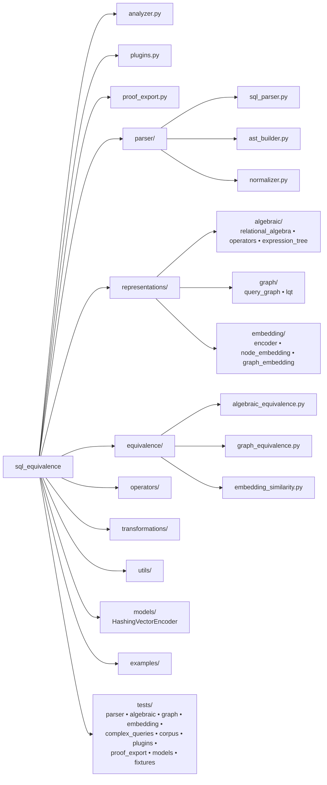

# SQL Equivalence Analysis Library

A Python library for analyzing SQL query equivalence through three complementary
lenses: **algebraic** (relational-algebra canonical form), **graph-based**
(isomorphism and structural similarity over the query graph), and
**embedding-based** (vector similarity over learned or hashed representations).

Part of the Open NL2SQL / Chat2BI course (2025-Dec).

License: Apache 2.0 — Yifan Yang `<yfyang.86@hotmail>`

Cite:

```latex
@misc{yfyang2025sqlequiv,
    title={A comprehensive Python library for analyzing SQL query equivalence using algebraic, graph-based, and embedding-based approaches.},
    year={2025},
    author={Yifan Yang},
    url={https://github.com/yfyang86/SQLEquiv}
}
```

---

## Development status

**Alpha, under active development.** The four-phase roadmap in
[`Future-Plan.md`](./Future-Plan.md) is fully landed on this branch:

- ✅ Phase A — all three analysis methods produce meaningful verdicts.
- ✅ Phase B — fixture corpus, ruff / mypy config, GitHub Actions CI matrix,
  latency bench.
- ✅ Phase C — plugin registry, hashing-baseline embedding model, PyPI-ready
  metadata, CHANGELOG.
- ✅ Phase D — Markdown / JSON proof export, Streamlit demo, HF-style
  dataset card for the corpus.

Current test status: **102 passed, 7 xfail-strict known-gap markers**. See
[`sql_equivalence/tests/fixtures.py`](./sql_equivalence/tests/fixtures.py) for
the curated regression corpus and
[`Future-Plan.md`](./Future-Plan.md) for the go / no-go list.

## Features

### Analysis methods

| Method | What it does | When to use |
|--------|--------------|-------------|
| `algebraic` | Converts both queries to relational-algebra canonical form, then checks structural identity with rule-based rewrites (selection pushdown, join commutativity, ...). Produces proof steps. | Precise equivalence up to the supported rewrite rules. |
| `graph` | Builds a `DiGraph` from the AST and runs attribute-aware `networkx.is_isomorphic`, falling back to a weighted similarity (node-type Jaccard + (type, value) Jaccard + degree / spectral distance). | Catches name-level differences (table, column, literal values). |
| `embedding` | Produces a deterministic vector (via `GraphEmbedding` over node features, or the built-in `HashingVectorEncoder`, or a plugin), then computes cosine similarity mapped to `[0, 1]`. | Approximate, fast; ideal for large candidate pools. |

All three methods run by default and the analyzer returns `is_equivalent=True`
only when all vote yes (unanimous agreement).

### Supported SQL

Built on [sqlglot](https://github.com/tobymao/sqlglot) — the library inherits
its dialect coverage (PostgreSQL is the reference dialect).

- SELECT with multi-column projection, `DISTINCT`, aliases.
- WHERE / GROUP BY / HAVING / ORDER BY / LIMIT.
- JOINs: INNER, LEFT, RIGHT, FULL (types are currently compared structurally,
  not semantically — see known gaps below).
- Set operations: UNION, UNION ALL, INTERSECT, EXCEPT.
- CTEs (`WITH ...`).
- Subqueries in FROM / WHERE (IN, EXISTS).
- Aggregate functions (COUNT, SUM, AVG, MIN, MAX).
- Window functions (ROW_NUMBER, RANK, ...) with `PARTITION BY` / `ORDER BY`.
- Scalar functions (UPPER, LOWER, COALESCE, ...).

### Extensibility

- **Plugin registry**: third-party packages can register a custom analysis
  method via the `sql_equivalence.methods` entry-point group, or at runtime
  via `analyzer.register_method(name, runner)`.
- **Custom embeddings**: pass any object with an `encode(query) -> np.ndarray`
  method to `SQLEquivalenceAnalyzer(embedding_model=...)`. Ships with a
  `HashingVectorEncoder` baseline.

## Installation

```bash
pip install sql-equivalence
```

Optional extras:

```bash
pip install "sql-equivalence[viz]"   # matplotlib + graphviz + plotly
pip install "sql-equivalence[ml]"    # torch + transformers (plugin targets)
pip install "sql-equivalence[dev]"   # pytest, ruff, mypy
```

The core install has no display-server or GPU dependencies — `graphviz` and
`plotly` are imported lazily only when visualization is invoked.

## Quick start

```python
from sql_equivalence import SQLEquivalenceAnalyzer

analyzer = SQLEquivalenceAnalyzer()

sql1 = "SELECT id, name FROM users WHERE age >= 18"
sql2 = "SELECT id, name FROM users WHERE age >= 18"   # identical

result = analyzer.analyze(sql1, sql2)
print(result.is_equivalent, result.confidence)       # True 1.0
for method, outcome in result.method_results.items():
    print(f"  {method}: {outcome['is_equivalent']} ({outcome['confidence']:.2f})")
```

Select specific methods, or ask for detailed output:

```python
result = analyzer.analyze(sql1, sql2, methods=["algebraic"], detailed=True)
print(result.method_results["algebraic"]["proof_steps"])
```

Use a custom embedding model:

```python
from sql_equivalence.models import HashingVectorEncoder
analyzer = SQLEquivalenceAnalyzer(embedding_model=HashingVectorEncoder(dim=256))
```

Register a custom analysis method:

```python
def vote_no(parsed1, parsed2, detailed):
    return {"is_equivalent": False, "confidence": 0.0, "equivalence_type": "not_equivalent"}

analyzer.register_method("vote_no", vote_no)
result = analyzer.analyze(sql1, sql2, methods=["algebraic", "vote_no"])
```

### Export a human-readable proof

```python
from sql_equivalence.proof_export import to_markdown, to_json
result = analyzer.analyze(sql1, sql2, detailed=True)
print(to_markdown(result))       # per-method votes, proof steps, canonical forms
print(to_json(result, indent=2)) # same as result.to_dict() with a repr fallback
```

### Streamlit demo

```bash
pip install streamlit
streamlit run scripts/streamlit_demo.py
```

### Latency benchmark

```bash
python scripts/bench.py --runs 10 --methods algebraic graph embedding
```

## Known limitations

The library is alpha and the three checkers have known blind spots that are
tracked as `xfail(strict=True)` regression markers in
`sql_equivalence/tests/fixtures.py::KNOWN_GAP_PAIRS`. Removing an entry from
that list requires the corresponding checker to be tightened. Current gaps:

- Opposite WHERE predicates (`age > 10` vs `age < 10`).
- JOIN-type semantics (`INNER JOIN` vs `LEFT JOIN`).
- UNION vs UNION ALL (duplicate-preservation).
- LIMIT value (`LIMIT 10` vs `LIMIT 100`).
- Different aggregate functions (`COUNT(*)` vs `SUM(salary)`).
- Window function `PARTITION BY` column names are currently drowned out by
  the rest of the window scaffolding in graph similarity.

When in doubt, pin behavior with a test:

```bash
pytest sql_equivalence/tests/ -q
```

## Project layout

```
sql_equivalence/
├── __init__.py
├── analyzer.py                   # SQLEquivalenceAnalyzer (public entry point)
├── plugins.py                    # register_method / load_entry_points
├── proof_export.py               # Markdown / JSON renderer for AnalysisResult
│
├── parser/
│   ├── sql_parser.py             # SQLParser, ParsedQuery (sqlglot-backed)
│   ├── ast_builder.py            # sqlglot → ASTNode tree
│   └── normalizer.py             # whitespace / case / AST normalization
│
├── representations/
│   ├── base.py                   # QueryRepresentation ABC
│   ├── algebraic/
│   │   ├── relational_algebra.py # AlgebraicExpression
│   │   ├── operators.py          # Algebraic operators (π, σ, ⋈, ...)
│   │   └── expression_tree.py    # ExpressionTree + lazy graphviz viz
│   ├── graph/
│   │   ├── query_graph.py        # NetworkX-backed AST graph
│   │   └── lqt.py                # Logical Query Tree (rooted)
│   └── embedding/
│       ├── encoder.py            # QueryEncoder ABC
│       ├── node_embedding.py     # Deterministic hashed node vectors
│       └── graph_embedding.py    # Mean/sum/max pooling over nodes
│
├── equivalence/
│   ├── base.py                   # EquivalenceChecker + EquivalenceResult
│   ├── algebraic_equivalence.py  # Rule-based algebraic checker
│   ├── graph_equivalence.py      # NetworkX isomorphism + similarity cascade
│   └── embedding_similarity.py   # Cosine + optional ensemble
│
├── operators/                    # Clause-level operator classes
├── transformations/              # Algebraic / graph rewrite rules
├── utils/                        # sql_utils, graph_utils, visualization
├── models/
│   ├── embedding_models.py       # HashingVectorEncoder
│   └── ...                       # Placeholders for ML plug-ins
│
├── examples/                     # Hand-written runnable examples
└── tests/
    ├── fixtures.py               # Curated corpus + KNOWN_GAP_PAIRS
    ├── test_parser.py
    ├── test_algebraic.py
    ├── test_graph.py
    ├── test_embedding.py
    ├── test_complex_queries.py   # CTEs, windows, set ops, subqueries
    ├── test_corpus.py
    ├── test_plugins.py
    ├── test_proof_export.py
    └── test_models.py
```


```mermaid
graph LR
    A[sql_equivalence] --> AN[analyzer.py]
    A --> PL[plugins.py]
    A --> PE[proof_export.py]

    A --> P[parser/]
    P --> P1[sql_parser.py]
    P --> P2[ast_builder.py]
    P --> P3[normalizer.py]

    A --> R[representations/]
    R --> RA[algebraic/<br/>relational_algebra • operators • expression_tree]
    R --> RG[graph/<br/>query_graph • lqt]
    R --> RE[embedding/<br/>encoder • node_embedding • graph_embedding]

    A --> E[equivalence/]
    E --> EA[algebraic_equivalence.py]
    E --> EG[graph_equivalence.py]
    E --> EM[embedding_similarity.py]

    A --> O[operators/]
    A --> T[transformations/]
    A --> U[utils/]
    A --> M[models/<br/>HashingVectorEncoder]

    A --> X[examples/]
    A --> TS[tests/<br/>parser • algebraic • graph • embedding •<br/>complex_queries • corpus • plugins •<br/>proof_export • models • fixtures]
```

## Development

```bash
git clone https://github.com/yfyang86/SQLEquiv
cd SQLEquiv
pip install -e "sql_equivalence[dev]"

pytest sql_equivalence/tests/ -q                # 102 passed, 7 xfailed
ruff check sql_equivalence                      # lint
python scripts/bench.py --runs 5                # latency smoke bench
```

CI runs the suite on Python 3.8 / 3.10 / 3.12 (see `.github/workflows/ci.yml`).
